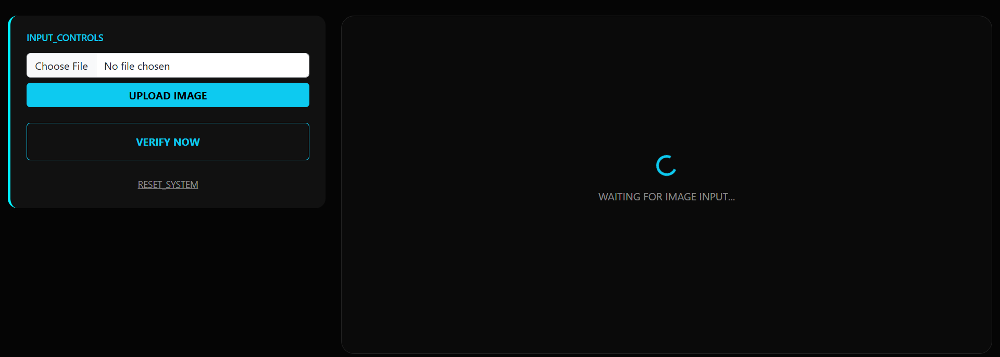
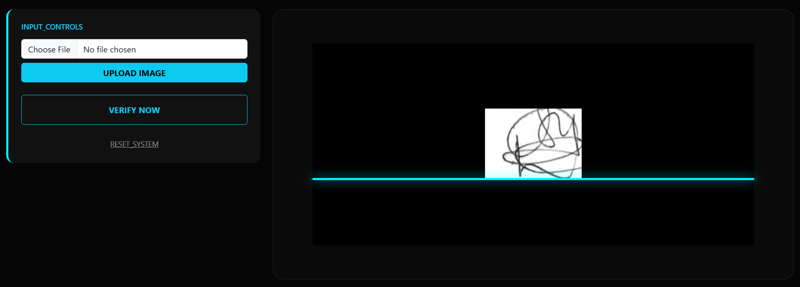
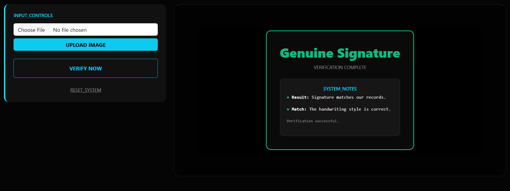
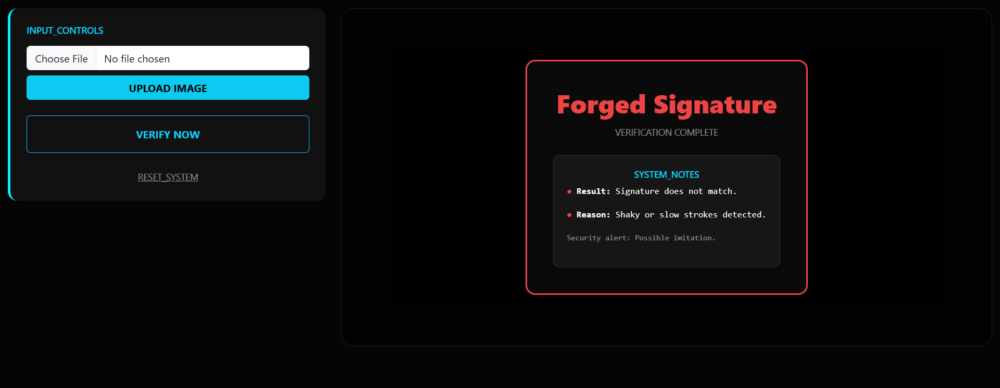

# ✍️ Signature Verification System

##  Overview
This project is a Signature Verification System that checks whether a signature is **Genuine or Forged**.  
It uses image processing and basic machine learning concepts to analyze the signature.

---

## Problem
In places like banks and exams, signatures are checked manually.  
This can be wrong because fake signatures can look similar and people may make mistakes.

So, this system helps by checking signatures automatically.

---

## 🚀 Features
- Upload a signature image  
- Detect if it is genuine or forged  
- Simple web interface  
- Fast and automatic result  

---

##  Technologies Used
- Python  
- Flask  
- HTML, CSS  
- OpenCV  

---

##  Concepts Used
- Image Processing (cleaning the image)  
- Feature Extraction (getting important details)  
- Machine Learning (SVM)  
- Line Sweep Algorithm  

---

## How It Works
1. User uploads a signature  
2. Image is cleaned (grayscale & black-white)  
3. Important features are extracted  
4. System analyzes the signature  
5. Result is shown (Genuine / Forged)  

---

## 📂 Project Files
- `app.py` → Main program (Flask)  
- `svm.py` → Prediction logic  
- `features.py` → Feature extraction  
- `linesweep.py` → Line Sweep Algorithm  
- `templates/` → Frontend files  
- `static/` → Images and styles  

---

## ▶️ How to Run
- git clone https://github.com/udeepa09/Signature-Verification.git
- cd Signature-Verification
- pip install -r requirements.txt
- python app.py.

## usage
Open browser → http://127.0.0.1:5000/⁠�
Upload image
Click verify 
See result

## Screenshots

### Home Page

## verification 

### ✅ Genuine Result

### ❌ Forged Result

## Future Work
Add real ML model
Improve accuracy
Build mobile app

## Conclusion
This project shows how computers can be used to check signatures automatically in a simple and fast way.

